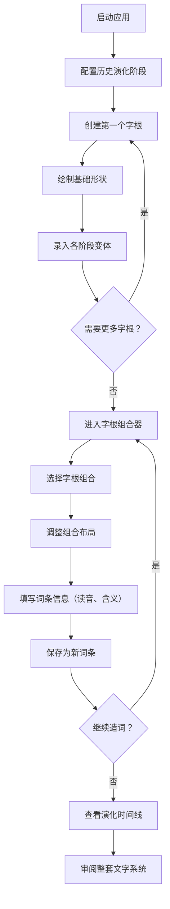

## 1. 产品概述

虚构语言字形演化板是一款面向世界构建爱好者、语言创作者、作家和游戏设计师的前端工具，用于创建、管理和演化一套完整的虚构文字系统。用户可以定义字根、记录字形演变历史、组合生成词条，并像真正维护一门古老语言一样沉浸其中。

- 核心价值：为虚构世界构建者提供专业级的文字系统设计工具
- 目标用户：语言爱好者、奇幻作家、TRPG设计师、独立游戏开发者
- 差异化：兼具历史演化视角与即时造词能力的沉浸式交互体验

## 2. 核心功能

### 2.1 用户角色
本工具为单用户前端应用，无角色区分。

### 2.2 功能模块
1. **字形网格页**：字根库总览、分类筛选、快速搜索、卡片式展示
2. **演化时间线页**：历史阶段导航、字形演变可视化、变体对比
3. **字根编辑器**：创建/编辑字根、定义基础形状、录入各阶段变体
4. **字根组合器**：拖拽选择字根、实时预览组合字形、调整书写规则
5. **词条编辑器**：保存新词读音、含义、书写规则、词条库管理

### 2.3 页面详情
| 页面名称 | 模块名称 | 功能描述 |
|-----------|-------------|---------------------|
| 主工作台 | 顶部导航栏 | 系统名称、页面切换Tab、导出/导入按钮 |
| 字形网格 | 网格主区域 | 字根卡片阵列，展示字形、含义、所属阶段 |
| 字形网格 | 筛选工具栏 | 按历史阶段筛选、按含义搜索、排序方式切换 |
| 演化时间线 | 阶段时间轴 | 横向可滚动时间轴，各历史阶段节点 |
| 演化时间线 | 演化对比区 | 选中字根在各阶段的字形并排对比展示 |
| 字根编辑器 | 基础信息表单 | 字根名称、含义、读音、所属分类 |
| 字根编辑器 | SVG绘画面板 | 自由绘制基础形状、预设图形快捷插入 |
| 字根编辑器 | 阶段变体管理 | 为每个历史阶段添加/编辑/删除变体字形 |
| 字根组合器 | 字根选择区 | 点击/拖拽添加字根到组合槽位 |
| 字根组合器 | 组合预览区 | 实时渲染组合字形、调整结构布局（上下/左右/包围） |
| 字根组合器 | 书写规则设置 | 笔画顺序、书写方向、连写规则 |
| 词条编辑器 | 词条信息表单 | 读音、含义分类、例句、备注 |
| 词条编辑器 | 词条列表 | 已保存词条的搜索、筛选、编辑、删除 |

## 3. 核心流程

用户创建一套虚构文字系统的典型流程：首先配置几个历史演化阶段（如：古体→篆体→今体），然后逐一创建字根并录入其在各阶段的字形变体，接着通过组合已有字根生成新的复合词条，最后在时间线视图中审阅整套文字的演变脉络。

## 4. 用户界面设计

### 4.1 设计风格
- **美学方向**：古籍羊皮卷风格，温润典雅，带有岁月沉淀感
- **主色调**：深褐色 `#3E2723` 作为主色，搭配羊皮纸米黄 `#F5E6C8` 背景
- **点缀色**：朱砂红 `#B23A29` 用于重点标记和选中态，青铜绿 `#5D7A6F` 用于时间线节点
- **字体方案**：标题使用「霞鹜文楷」或类似楷体，正文使用「思源宋体」，营造古籍质感
- **按钮风格**：圆角矩形、微浮雕质感、悬停时轻微上浮，像一枚枚印章
- **图标风格**：线性图标，搭配手写笔触质感，使用 lucide-react 统一图标库
- **质感细节**：全局添加纸张噪点纹理、微羊皮卷边缘装饰、淡墨迹晕染效果

### 4.2 页面设计概述
| 页面名称 | 模块名称 | UI元素 |
|-----------|-------------|-------------|
| 主工作台 | 顶部导航栏 | 深褐底+烫金字、页面切换Tab带下划线动画、右上角印章式按钮 |
| 字形网格 | 网格主区域 | 卡片式布局，每卡含SVG字形预览+含义标签+阶段标记，悬停放大 |
| 演化时间线 | 阶段时间轴 | 横向卷轴式布局，节点用青铜色圆点+阶段名，当前节点朱砂高亮 |
| 字根编辑器 | SVG绘画面板 | 米黄画布+网格辅助线、左侧工具栏（笔、矩形、圆、橡皮） |
| 字根组合器 | 组合预览区 | 组合槽位用虚线框表示，拖拽字根入槽后自动渲染组合效果 |
| 词条编辑器 | 词条卡片 | 古籍书页样式，竖排读音+横排释义，右下角朱砂印章式删除按钮 |

### 4.3 响应式
- 桌面端优先设计（最小宽度 1280px）
- 三栏布局（工具栏 + 主内容 + 详情面板）
- 平板端：两栏自适应，详情面板改为底部抽屉
- 移动端：单栏堆叠，Tab导航改为底部菜单

### 4.4 交互动效
- 页面切换：卷轴展开/收起过渡动画
- 字根选中：朱砂红边框高亮 + 轻微上浮阴影
- 组合操作：字根飞入组合槽位的抛物线动画
- 时间线滚动：节点依次点亮的渐显效果
- SVG绘制：笔画轨迹用手绘速度曲线（非匀速）呈现
