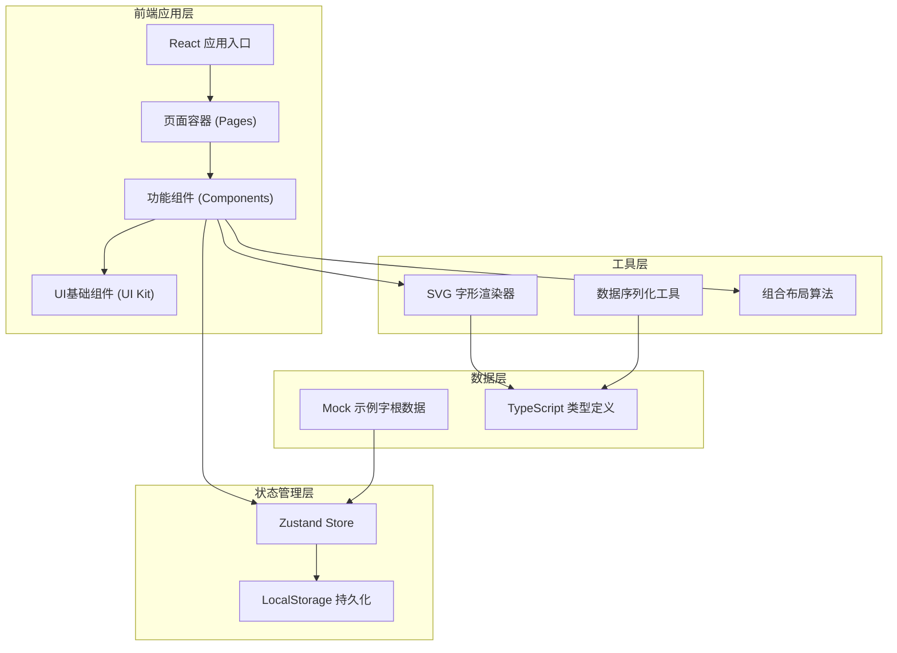
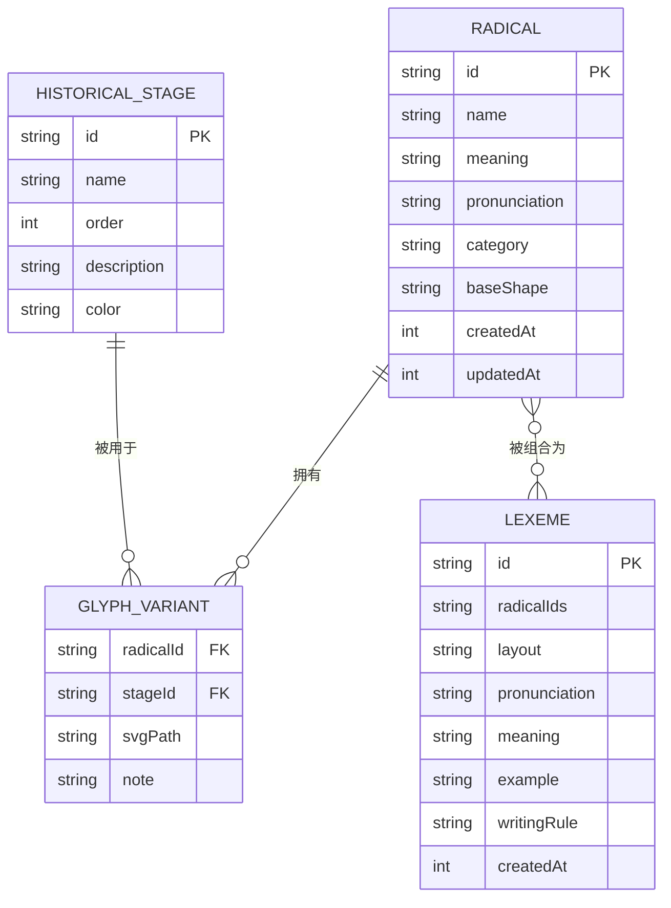

## 1. 架构设计



## 2. 技术描述
- **前端框架**：React 18 + TypeScript
- **构建工具**：Vite 6
- **样式方案**：Tailwind CSS 3 + CSS 变量主题系统
- **状态管理**：Zustand 4（含 persist 中间件，数据持久化到 localStorage）
- **路由方案**：React Router DOM 6（HashRouter，纯前端路由）
- **图标库**：lucide-react
- **SVG绘制**：原生 SVG + 自定义简易绘制工具（无需额外依赖）
- **数据持久化**：浏览器 localStorage，支持 JSON 导入/导出
- **初始化工具**：使用 vite-init 生成 react-ts 模板

## 3. 路由定义
| 路由路径 | 页面名称 | 页面用途 |
|----------|----------|----------|
| `/` | 重定向到字形网格 | 默认首页跳转 |
| `/glyphs` | 字形网格页 | 字根库总览、筛选、搜索、快速创建入口 |
| `/timeline` | 演化时间线页 | 历史阶段展示、字形演变对比、演化审阅 |
| `/editor/radical` | 字根编辑器 | 新建/编辑字根、绘制字形、管理阶段变体 |
| `/composer` | 字根组合器 | 选择字根组合、预览、调整布局 |
| `/lexicon` | 词条编辑器 | 词条信息录入、词条库管理、搜索筛选 |

## 4. API 定义
本项目为纯前端应用，无后端 API。所有数据操作通过 Zustand store 进行，核心接口如下：

```typescript
// 核心数据类型定义
interface HistoricalStage {
  id: string;
  name: string;          // 阶段名，如"古体"、"篆体"、"今体"
  order: number;         // 排序序号
  description: string;   // 阶段描述
  color: string;         // 标记色
}

interface GlyphVariant {
  stageId: string;       // 对应历史阶段
  svgPath: string;       // SVG path 数据
  note?: string;         // 变体备注
}

interface Radical {
  id: string;
  name: string;          // 字根名称/标识
  meaning: string;       // 字根含义
  pronunciation: string; // 读音（拼音/音标/自定义）
  category: string;      // 分类：象形/指事/会意等
  baseShape: string;     // 基础形状 SVG path
  variants: GlyphVariant[]; // 各阶段变体
  createdAt: number;
  updatedAt: number;
}

type CompositionLayout = 'horizontal' | 'vertical' | 'surround' | 'overlay';

interface Lexeme {
  id: string;
  radicalIds: string[];       // 组成字根ID列表
  layout: CompositionLayout;  // 组合布局方式
  pronunciation: string;      // 词条读音
  meaning: string;            // 词条含义
  example?: string;           // 例句
  note?: string;              // 备注
  writingRule?: string;       // 书写规则
  createdAt: number;
}

// Zustand Store 接口
interface WritingSystemStore {
  // 数据
  stages: HistoricalStage[];
  radicals: Radical[];
  lexemes: Lexeme[];
  // UI状态
  selectedRadicalId: string | null;
  selectedStageId: string | null;
  // 阶段操作
  addStage: (s: Omit<HistoricalStage, 'id'>) => void;
  updateStage: (id: string, patch: Partial<HistoricalStage>) => void;
  removeStage: (id: string) => void;
  // 字根操作
  addRadical: (r: Omit<Radical, 'id' | 'createdAt' | 'updatedAt'>) => void;
  updateRadical: (id: string, patch: Partial<Radical>) => void;
  removeRadical: (id: string) => void;
  // 词条操作
  addLexeme: (l: Omit<Lexeme, 'id' | 'createdAt'>) => void;
  updateLexeme: (id: string, patch: Partial<Lexeme>) => void;
  removeLexeme: (id: string) => void;
  // 选择操作
  selectRadical: (id: string | null) => void;
  selectStage: (id: string | null) => void;
  // 导入导出
  exportData: () => string;
  importData: (json: string) => void;
}
```

## 5. 数据模型
### 5.1 ER 关系图



### 5.2 初始化数据
应用初始化时自动注入以下 Mock 数据，确保首次打开即有内容可交互：

| 数据类型 | 初始数量 | 内容示例 |
|----------|----------|----------|
| HistoricalStage | 4 | 甲骨文 → 金文 → 小篆 → 楷书（对应虚构语言版本） |
| Radical | 12+ | "日"(太阳)、"月"(月亮)、"山"(山峰)、"水"(流水)、"人"(人形)、"木"(树木)、"火"(火焰)、"口"(嘴巴)、"手"(手掌)、"目"(眼睛)、"心"(心脏)、"田"(田地) 等象形字根 |
| Lexeme | 6+ | "明"(日+月)、"休"(人+木)、"看"(手+目)、"思"(田+心)、"唱"(口+日)、"仙"(人+山) 等组合词条 |
